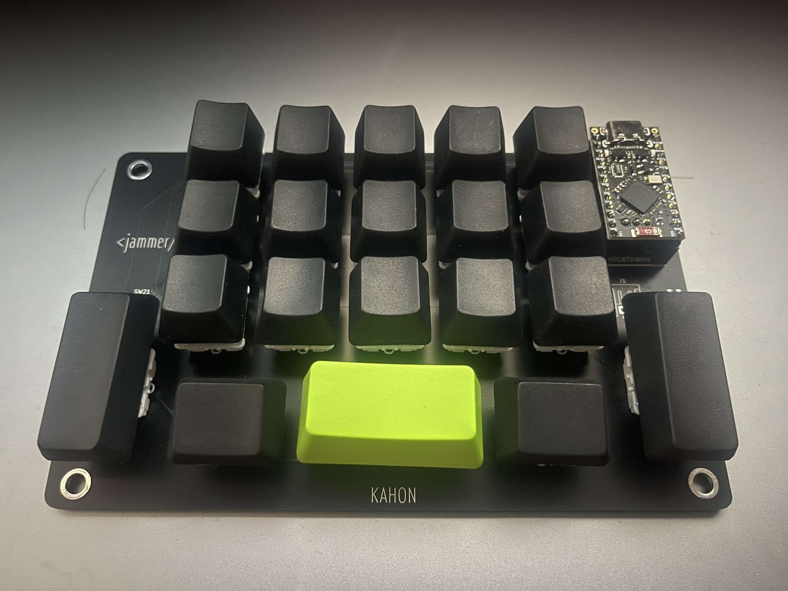

# kahon



This is a wireless bluetooth, one-handed keyboard inspired by the Frogpad.
It is a minimal build, no diodes, and uses a nice!nano compatible controller. It is also not hot-swappable, but MX-profile or v1 choc-profile switches are supported. The firmware included is custom based on ZMK.

It should also be possible to pair another board to make it a 40% split-keyboard. It will need some work to modify the code, though. May update that in the future.

## Requirements

- 1pc nice!nano, or compatible board
- 20 switches (MX or choc v1)
- reset button
- 3.7v lithium battery
- power switch (optional)
- J1 socket (optional)

## Layout

As my only reference were pictures of the Frogpad layout, I decided to start building the first two layers for the alpha-keys from there. Over the course of a weekend I redesigned the layout, moving letters around when it felt uncomfortable as I was using Monkeytype to test the layout.

It was quite the challenge to figure out how to type keys with modifiers, so I ended up created a whole new layer for the common shortcuts I use (Copy/Paste, etc).

I haven't really tried using this for work yet, but have been using it for chatting with friends. Still a bit slow, fastest I've reached is 26wpm on monkeytype. 

## Case

I still haven't learned 3D modelling to print my own cases, but this is something I would like to start doing soon.

## Customizing the keymap

1. Setup your local development following the instructions from here: https://zmk.dev/docs/development/local-toolchain/setup
2. Create a new `kahon` folder in `app/boards/shields/`.
3. Copy the files inside the `zmk` from this repository into your newly created folder.
4. From inside the `app` folder run this on the terminal
   ```sh
   west -p build -d build/kahon -b nice_nano_v2 -- -DSHIELD=kahon
   ```
5. If compile is successful, you should find a `zmk.uf2` file inside `app/build/kahon/zephyr`
6. Flash the board with the `zmk.uf2`
